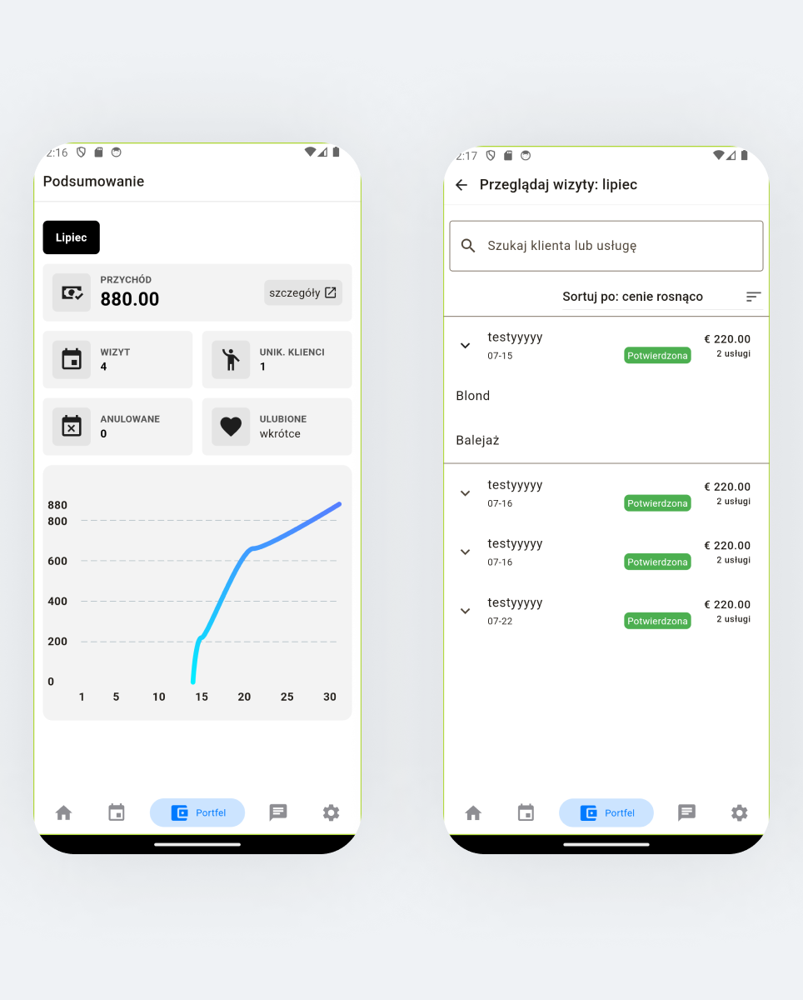
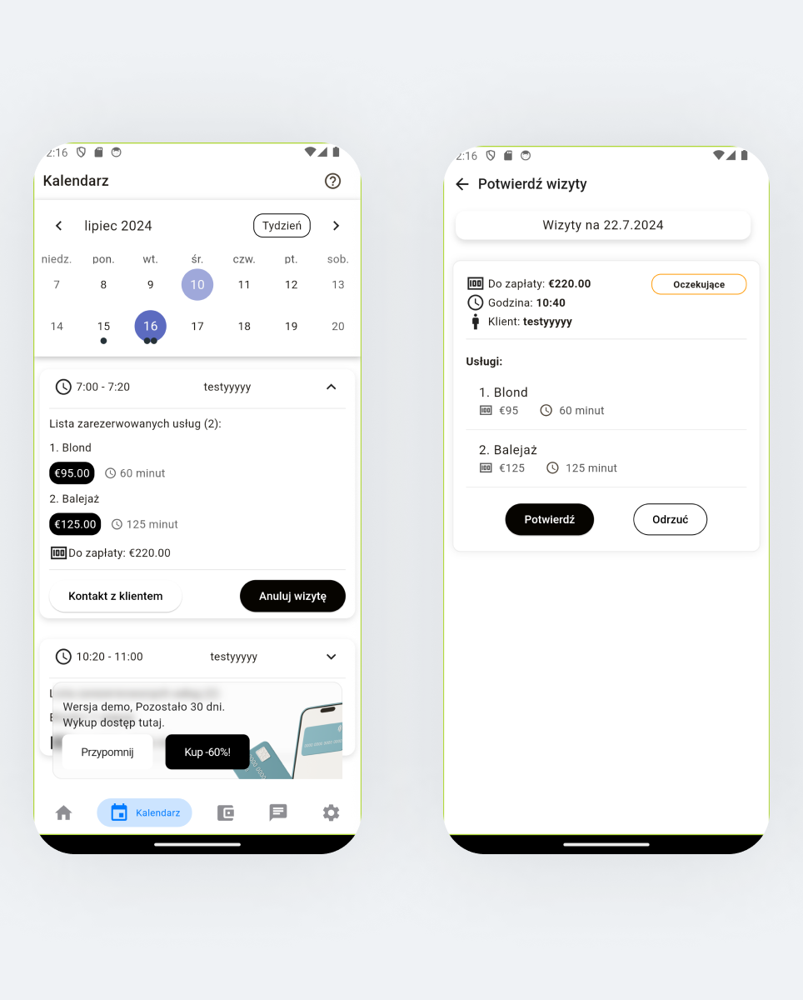
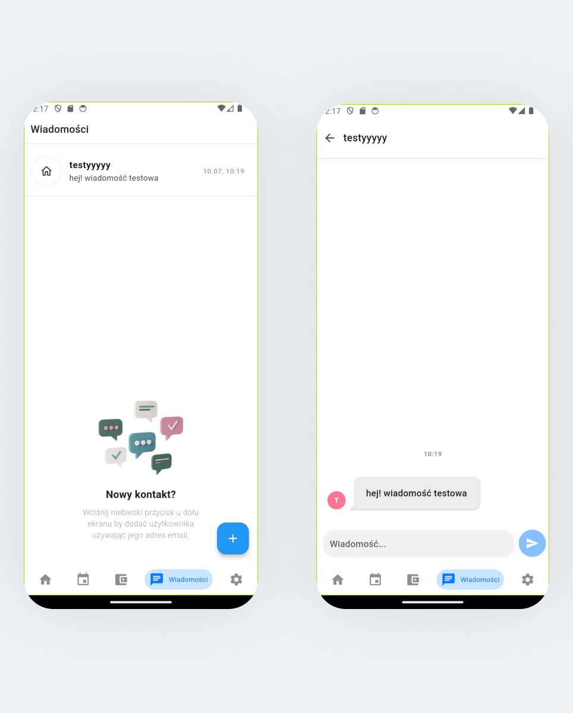

# management-app (findovio_biz)

Trying to achieve a simple process of finding a beauty salon by offering features such as customer account, salon search (by keywords, city, in radius), and an overview of booked services. Customers can rate salons, save favorite locations, repeat previous bookings with customization options, and navigate a user-friendly booking process - selecting services, and confirming the price and appointment time, culminating in the final booking confirmation.

# App Showcase

## Login

### Create salon

## Home

## Wallet

## Calendar

## Messages

## Settings

## main features

🚧 complete navigation

✅ welcome intro

✅ firebase auth
  ✅ forgotten credentials
  ✅ Social login

&nbsp;&nbsp;&nbsp;&nbsp;✅ login &nbsp;&nbsp;&nbsp;&nbsp;✅ register

🚧 Booking process

&nbsp;&nbsp;&nbsp;&nbsp;✅ from salon screen

&nbsp;&nbsp;&nbsp;&nbsp;&nbsp;&nbsp;&nbsp;&nbsp;✅ list salon services
&nbsp;&nbsp;&nbsp;&nbsp;&nbsp;&nbsp;&nbsp;&nbsp;✅ confirm chosen services
&nbsp;&nbsp;&nbsp;&nbsp;&nbsp;&nbsp;&nbsp;&nbsp;✅ select booking date
&nbsp;&nbsp;&nbsp;&nbsp;✅ confirmation screen

&nbsp;&nbsp;&nbsp;&nbsp;✅ Book again

&nbsp;&nbsp;&nbsp;&nbsp;✅ from favorite screen

✅ search

&nbsp;&nbsp;&nbsp;&nbsp;✅ By keywords, city and within the radius from the search query
✅(test: fryzjer)
✅(test: keywords = fryzjer, city = Gorzów Wielkopolski)

🚧 fetch api

&nbsp;&nbsp;&nbsp;&nbsp;✅ full model &nbsp;&nbsp;&nbsp;&nbsp;✅ thin model 
&nbsp;&nbsp;&nbsp;&nbsp;✅ services model
&nbsp;&nbsp;&nbsp;&nbsp;✅ reviews model &nbsp;&nbsp;&nbsp;&nbsp;✅ gallery

✅ OpenStreet map with a pin of salon localization

✅ messages

## navigation structure

## api resource 
[API Booking App - Python (Django DRF) with postgresql (+postGis) ](https://github.com/wardachD/API_Booking_app)

## test mode
login: testme@random.com
password: 12345678
